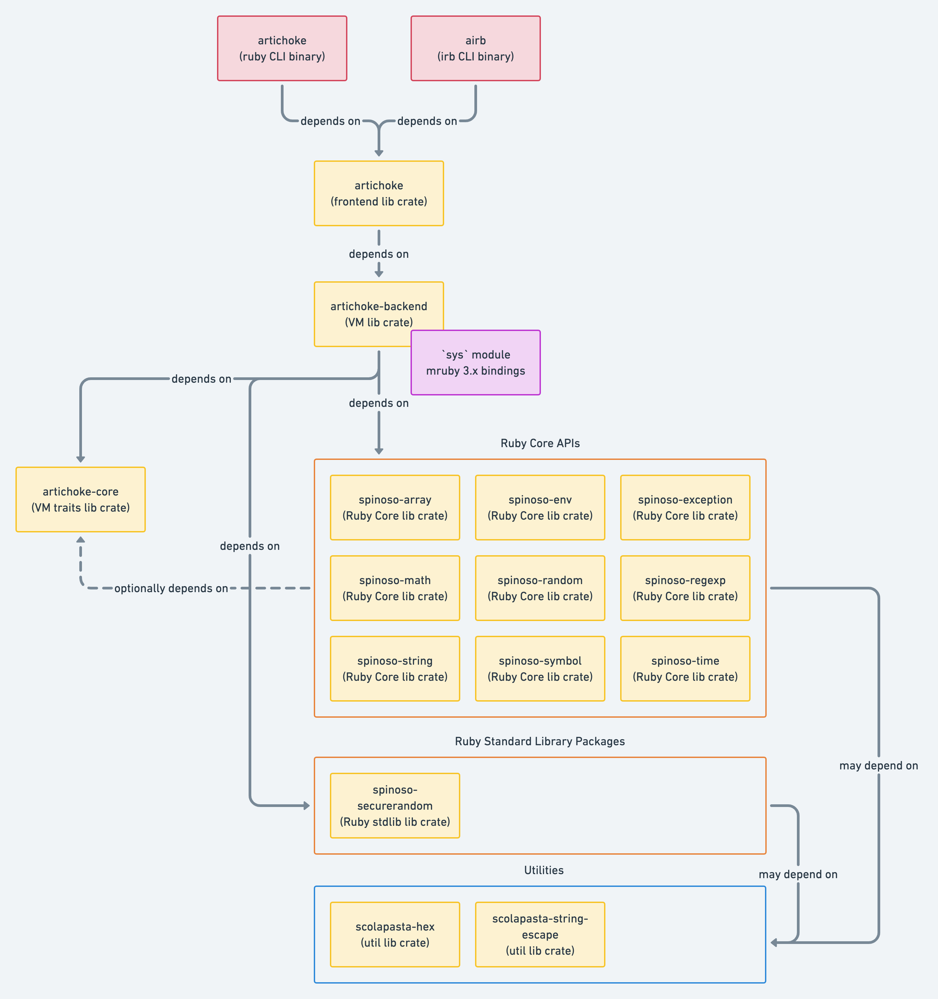

<!-- vim: set ft=markdown fenc=utf-8 spell spl=en -->

# Artichoke Ruby Architecture

Artichoke Ruby is a modular Ruby implementation written in Rust. Artichoke is
made up of several Rust libraries, called [crates], which are arranged in a
[Cargo workspace].

[crates]: https://doc.rust-lang.org/book/ch07-01-packages-and-crates.html
[cargo workspace]: https://doc.rust-lang.org/book/ch14-03-cargo-workspaces.html

_Aside_: This document uses the word "interpreter" to refer to a Ruby engine.
This word may mean either a VM-based or interpreted Ruby engine.

## Overview

<!-- source: https://whimsical.com/architecture-6tvfYsGZzs3FVqfk6J9KGw -->



Artichoke is organized into several layers:

- [Binaries and frontend](#frontend)
- [Interpreter backend](#interpreter-backend)
- [Interpreter core APIs](#core-interpreter-traits)
- [Ruby Core data structures and APIs](#ruby-core-apis-and-standard-library-packages)
- [Utilities](#utilities)

### Frontend

The entry point to Artichoke for running Ruby code is the `artichoke` crate. The
code for this crate is located in the [`src` directory](src). All functionality
of Artichoke Ruby is accessible through this crate. You'll likely want to create
an interpreter with [`artichoke::interpreter()`] and import the
[`artichoke::prelude::*`] items to bring the traits that define the interpreter
APIs into scope.

```rust
use artichoke::prelude::*;

let mut interp = artichoke::interpreter()?;
let value = interp.eval(b"[nil] * 3")?;
let len = value.funcall(&mut interp, "length", &[], None)?;
let len = len.try_into::<usize>(&interp)?;
assert_eq!(len, 3);
```

[`artichoke::interpreter()`]:
  https://artichoke.github.io/artichoke/artichoke/fn.interpreter.html
[`artichoke::prelude::*`]:
  https://artichoke.github.io/artichoke/artichoke/prelude/index.html

The frontend crate provides [two binary targets]:

- `artichoke` is the Ruby CLI frontend.
- `airb` is Artichoke's [`irb` shell].

[two binary targets]: README.md#Usage
[`irb` shell]: https://en.wikipedia.org/wiki/Interactive_Ruby_Shell

The frontend implements command line argument parsing and a readline shell,
reads source programs from disk or standard input (stdin), formats exception
backtraces, and evaluates code on an interpreter backend.

### Interpreter Backend

Artichoke uses a "backend" crate to implement the core interpreter APIs.

Backend crates integrate a parser, Ruby VM or interpreter, and stitch together
core APIs and standard library packages to create a Ruby environment.
Interpreter backends are expected to implement the core interpreter traits from
[`artichoke-core`][artichoke-core-docs].

Artichoke currently implements one interpreter backend [based on mruby
3.0.0][b-mruby], `artichoke-backend`. The project has plans to implement an
[MRI-based backend][b-mri] crate and a [pure Rust backend][b-artichoke].

[artichoke-core-docs]: https://artichoke.github.io/artichoke/artichoke_core/
[b-mruby]: https://github.com/artichoke/artichoke/labels/B-mruby
[b-mri]: https://github.com/artichoke/artichoke/labels/B-MRI
[b-artichoke]: https://github.com/artichoke/artichoke/labels/B-Artichoke

#### `artichoke-backend`

[`artichoke-backend`][artichoke-backend-docs] is an interpreter backend that
uses the [mruby VM] and parser. The code for this crate is located in the
[`artichoke-backend` directory][artichoke-backend-src].

The [mruby C sources] are built into a static library using a [custom build
process][mruby-build] and exposed via [`bindgen`] in the [`sys` module].

`artichoke-backend` implements some core interpreter traits from
`artichoke-core` with mruby APIs, for example, [getting and setting global
variables][mruby-globals]. Previous project goals and execution localized mruby
`sys` calls to only core traits, for example [artichoke/artichoke#562][gh-562].

As core APIs and data structures are implemented in _Spinoso_ crates,
`artichoke-backend` will disable mruby C functions, [reimplement them in
Rust][artichoke-strangler], and expose `unsafe extern "C" fn` replacements for
interoperability with the remaining mruby pieces. This process is an application
of the [Strangler Fig pattern].

[artichoke-backend-docs]:
  https://artichoke.github.io/artichoke/artichoke_backend/
[mruby vm]: https://github.com/mruby/mruby
[artichoke-backend-src]: artichoke-backend
[mruby c sources]: artichoke-backend/vendor/mruby
[mruby-build]: artichoke-backend/build.rs
[`bindgen`]: https://rust-lang.github.io/rust-bindgen/
[`sys` module]:
  https://artichoke.github.io/artichoke/artichoke_backend/sys/index.html
[mruby-globals]: artichoke-backend/src/globals.rs
[gh-562]: https://github.com/artichoke/artichoke/pull/562
[artichoke-strangler]:
  https://twitter.com/artichokeruby/status/1339578582222266368
[strangler fig pattern]:
  https://martinfowler.com/bliki/StranglerFigApplication.html

### Core Interpreter Traits

[`artichoke-core`][artichoke-core-docs] contains the traits required to
implement a fully functional and ruby/spec-compliant Ruby interpreter. The code
for this crate is located in the [`artichoke-core`
directory][artichoke-core-src].

`artichoke-core` is `no_std` + `alloc` with an optional (enabled by default)
`std` feature.

#### Interpreter APIs

Artichoke Core defines traits for the following interpreter capabilities:

- [`DefineConstant`][core-define-constant]: Define global, class, and module
  constants to be arbitrary Ruby [`Value`][core-value]s.
- [`Eval`][core-eval]: Execute Ruby source code on an interpreter from various
  sources.
- [`Globals`][core-globals]: Get, set, and unset interpreter-level global
  variables.
- [`Intern`][core-intern]: Intern byte strings to a cheap to copy and compare
  symbol type.
- [`Io`][core-io]: External I/O APIs, such as writing to the standard output of
  the current process.
- [`LoadSources`][core-load-sources]: [Require][kernel#require] source code from
  interpreter disk or [`File`][core-file] gems.
- [`Parser`][core-parser]: Manipulate the parser state, e.g. setting the current
  filename.
- [`Prng`][core-prng]: An interpreter-level pseudorandom number generator that
  is the backend for [`Random::DEFAULT`].
- [`Regexp`][core-regexp]: Manipulate [`Regexp`][regexp-globals] global state.
- [`ReleaseMetadata`][core-releasemetadata]: Enable interpreters to describe
  themselves.
- [`TopSelf`][core-topself]: Access to the root execution context.
- [`Warn`][core-warn]: Emit warnings.

Artichoke Core also describes what capabilities a Ruby [`Value`][core-value]
must have and how to [convert][core-convert-module] between Ruby VM and Rust
types.

[artichoke-core-src]: artichoke-core
[kernel#require]: https://ruby-doc.org/core-3.1.2/Kernel.html#method-i-require
[`random::default`]: https://ruby-doc.org/core-3.1.2/Random.html#DEFAULT
[regexp-globals]:
  https://ruby-doc.org/core-3.1.2/Regexp.html#class-Regexp-label-Special+global+variables
[core-convert-module]:
  https://artichoke.github.io/artichoke/artichoke_core/convert/index.html
[core-define-constant]:
  https://artichoke.github.io/artichoke/artichoke_core/constant/trait.DefineConstant.html
[core-value]:
  https://artichoke.github.io/artichoke/artichoke_core/value/trait.Value.html
[core-eval]:
  https://artichoke.github.io/artichoke/artichoke_core/eval/trait.Eval.html
[core-globals]:
  https://artichoke.github.io/artichoke/artichoke_core/globals/trait.Globals.html
[core-intern]:
  https://artichoke.github.io/artichoke/artichoke_core/intern/trait.Intern.html
[core-io]: https://artichoke.github.io/artichoke/artichoke_core/io/trait.Io.html
[core-load-sources]:
  https://artichoke.github.io/artichoke/artichoke_core/load/trait.LoadSources.html
[core-file]:
  https://artichoke.github.io/artichoke/artichoke_core/file/trait.File.html
[core-parser]:
  https://artichoke.github.io/artichoke/artichoke_core/parser/trait.Parser.html
[core-prng]:
  https://artichoke.github.io/artichoke/artichoke_core/prng/trait.Prng.html
[core-regexp]:
  https://artichoke.github.io/artichoke/artichoke_core/regexp/trait.Regexp.html
[core-releasemetadata]:
  https://artichoke.github.io/artichoke/artichoke_core/release_metadata/trait.ReleaseMetadata.html
[core-topself]:
  https://artichoke.github.io/artichoke/artichoke_core/top_self/trait.TopSelf.html
[core-warn]:
  https://artichoke.github.io/artichoke/artichoke_core/warn/trait.Warn.html

### Ruby Core APIs and Standard Library Packages

The data structures and platform-specific code for APIs in [Ruby Core] and
[Standard Library] are implemented in the _Spinoso_ family of crates. (_Spinoso_
refers to _Carciofo spinoso di Sardegna_, the thorny artichoke of Sardinia. The
data structures defined in the `spinoso` family of crates form the backbone of
Ruby Core in Artichoke.)

_Spinoso_ crates aim to incorporate the following design goals:

- Declare the crate as `no_std` and/or no-`alloc` where possible.
- Depend on state-of-the-art crates.
- Expose multiple implementations of the same data structure such that they are
  [source-compatible].
- Gate independent functionality and optional implementations behind Cargo
  features.
- `#![forbid(unsafe_code)]` where possible.
- Require 100% API documentation: all APIs have examples, all APIs have panic
  docs and safety docs where relevant.
- Require unit tests.

Backend and frontend crates should propagate as many Cargo features of _Spinoso_
crates as possible.

[`spinoso-array`] and [`spinoso-env`] are two examples of typical _Spinoso_
crates.

[ruby core]: https://ruby-doc.org/core-3.1.2/
[standard library]: https://ruby-doc.org/stdlib-3.1.2/
[source-compatible]: https://hyperbo.la/w/source-level-polymorphism/
[`spinoso-array`]: https://artichoke.github.io/artichoke/spinoso_array/
[`spinoso-env`]: https://artichoke.github.io/artichoke/spinoso_env/

#### Array

`spinso-array` implements contiguous growable vector types that implement the
[Ruby `Array`] API. The code for this crate is located in the [`spinoso-array`
directory][spinoso-array-src]. `spinoso-array` is `no_std` + `alloc` and exports
two implementations:

- `Array`, which is implemented with [`Vec`][rust-alloc-vec].
- `SmallArray`, which is implemented with [`SmallVec`] from the [Servo project].

`Array` is enabled by default; `SmallArray` requires activating the
`small-array` Cargo feature. Both data structures have nearly identical APIs
(`Array` exposes additional ["raw parts"] APIs that are not present in
`SmallArray`) which allows downstream consumers of these data structures to swap
out implementations by changing an import.

[ruby `array`]: https://ruby-doc.org/core-3.1.2/Array.html
[spinoso-array-src]: spinoso-array
[rust-alloc-vec]: https://doc.rust-lang.org/alloc/vec/struct.Vec.html
[`smallvec`]:
  https://artichoke.github.io/artichoke/smallvec/struct.SmallVec.html
[servo project]: https://github.com/servo/rust-smallvec
["raw parts"]:
  https://artichoke.github.io/artichoke/spinoso_array/struct.Array.html#method.into_raw_parts

#### ENV

`spinoso-env` implements a hash-like accessor for environment variables which
can be used to build the [`ENV`][ruby-core-env] singleton object from Ruby Core.
The code for this crate is located in the [`spinoso-env`
directory][spinoso-env-src]. `spinoso-env` exports two implementations:

- `Memory`, which is a fake, in-memory store using a
  [`HashMap`][rust-std-hashmap].
- `System`, which is implemented with the platform APIs in the
  [`std::env`][rust-std-env] module.

`Memory` is enabled by default; `System` requires activating the `system-env`
Cargo feature. Both data structures have identical APIs which allows downstream
consumers of these data structures to swap out implementations by changing an
import.

`Memory` allows an interpreter to expose an `ENV` API in embedded environments
where it may be undesirable for Ruby code to modify the host process's
environment.

[ruby-core-env]: https://ruby-doc.org/core-3.1.2/ENV.html
[spinoso-env-src]: spinoso-env
[rust-std-hashmap]:
  https://doc.rust-lang.org/nightly/std/collections/hash/map/struct.HashMap.html
[rust-std-env]: https://doc.rust-lang.org/nightly/std/env/index.html

### Utilities

Several _Spinoso_ crates require shared utilities. These utilities are extracted
into separate crates prefixed with `scolapasta-`. (_Scolapasta_ refers to a
specialized colander used to drain pasta. The utilities defined in the
`scolapasta` family of crates are the kitchen tools for preparing Artichoke
Ruby.)

## Ecosystem

### Nightly Builds

The [artichoke/nightly] repository uses a [nightly scheduled GitHub Actions
workflow][github-actions-nightly] to publish [nightly pre-built binary
artifacts][nightly-releases].

These releases are also available through [`ruby-build`] for Linux, macOS, and
Apple Silicon macOS. To install, run:

```console
$ mkdir -p ~/.rubies
$ ruby-build artichoke-dev ~/.rubies/artichoke
```

or use [`rbenv install`]:

```console
$ rbenv install artichoke-dev
```

Currently supported nightly targets are:

- [`x86_64-unknown-linux-gnu`]
- [`x86_64-unknown-linux-musl`]
- [`x86_64-apple-darwin`]
- [`x86_64-pc-windows-msvc`]
- [`aarch64-apple-darwin`] (Apple Silicon)

[artichoke/nightly]: https://github.com/artichoke/nightly
[github-actions-nightly]:
  https://github.com/artichoke/nightly/blob/trunk/.github/workflows/nightly.yaml
[nightly-releases]: https://github.com/artichoke/nightly/releases
[`ruby-build`]: https://github.com/rbenv/ruby-build
[`rbenv install`]: https://github.com/rbenv/rbenv#installing-ruby-versions
[`x86_64-unknown-linux-gnu`]:
  https://github.com/artichoke/nightly/releases/latest/download/artichoke-nightly-x86_64-unknown-linux-gnu.tar.gz
[`x86_64-unknown-linux-musl`]:
  https://github.com/artichoke/nightly/releases/latest/download/artichoke-nightly-x86_64-unknown-linux-musl.tar.gz
[`x86_64-apple-darwin`]:
  https://github.com/artichoke/nightly/releases/latest/download/artichoke-nightly-x86_64-apple-darwin.tar.gz
[`x86_64-pc-windows-msvc`]:
  https://github.com/artichoke/nightly/releases/latest/download/artichoke-nightly-x86_64-pc-windows-msvc.zip
[`aarch64-apple-darwin`]:
  https://github.com/artichoke/nightly/releases/latest/download/artichoke-nightly-aarch64-apple-darwin.tar.gz

### Nightly Containers

The [artichoke/docker-artichoke-nightly] repository uses a [nightly scheduled
GitHub Actions workflow][github-actions-docker-nightly] to publish Docker builds
to the [`artichokeruby/artichoke` repository on Docker Hub][docker-hub].

To pull and run an image, run:

```console
$ docker run -it docker.io/artichokeruby/artichoke airb
```

Currently supported Docker platforms are listed at:

- <https://github.com/artichoke/docker-artichoke-nightly/blob/trunk/README.md#platforms>

[artichoke/docker-artichoke-nightly]:
  https://github.com/artichoke/docker-artichoke-nightly
[github-actions-docker-nightly]:
  https://github.com/artichoke/docker-artichoke-nightly/blob/trunk/.github/workflows/docker-nightly.yaml
[docker-hub]: https://hub.docker.com/r/artichokeruby/artichoke

### Playground

The Artichoke project maintains a [Wasm]-based playground at
<https://artichoke.run> which exposes a REPL with a [Monaco Editor] environment.

Because of the mruby C dependency, the playground compiles to Wasm with Rust's
[Emscripten] target.

[wasm]: https://webassembly.org/
[monaco editor]: https://microsoft.github.io/monaco-editor/
[emscripten]: https://emscripten.org/

#### Try Artichoke

<p align="center">
  <a href="https://artichoke.run">
    
  </a>
  <br>
  <em>Artichoke Ruby Wasm Playground</em>
</p>

You can [try Artichoke in your browser][playground]. The [Artichoke
Playground][playground-repo] runs a [WebAssembly] build of
[Artichoke][artichoke-repo].

[playground]: https://artichoke.run
[playground-repo]: https://github.com/artichoke/playground
[webassembly]: https://webassembly.org/
[artichoke-repo]: https://github.com/artichoke/artichoke

### Project Website

The Artichoke project hosts a project website at
<https://www.artichokeruby.org>.

The website is a static site built with a custom static site generator which is
deployed on [GitHub Pages]. The source code can be found in the
[artichoke/www.artichokeruby.org] repository and is [deployed
automatically][github-actions-www-deploy] when PRs are merged.

[github pages]: https://pages.github.com/
[artichoke/www.artichokeruby.org]:
  https://github.com/artichoke/www.artichokeruby.org
[github-actions-www-deploy]:
  https://github.com/artichoke/www.artichokeruby.org/blob/trunk/.github/workflows/ci.yaml
